# Developer Guide for MangaTantou
## Table of Contents
<!-- TOC -->
* [Developer Guide for MangaTantou](#developer-guide-for-mangatantou)
* [Acknowledgements](#acknowledgements)
* [Design & Implementation](#design--implementation)
  * [Overall Architecture](#overall-architecture)
    * [Representing Data in MangaTantou](#representing-data-in-mangatantou)
    * [Parsing Architecture](#parsing-architecture)
    * [Commands](#commands)
    * [Saving Data](#saving-data)
    * [Displaying Data](#displaying-data)
  * [Interacting with the User](#interacting-with-the-user)
    * [Command Processing Sequence](#command-processing-sequence)
    * [AddAuthorCommand](#addauthorcommand)
    * [AddMangaCommand](#addmangacommand)
    * [DeleteAuthorCommand](#deleteauthorcommand)
    * [DeleteMangaCommand](#deletemangacommand)
    * [ViewCommand](#viewcommand)
    * [AddSalesCommand](#addsalescommand)
    * [AddDeadlineCommand](#adddeadlinecommand)
* [Product Scope](#product-scope)
  * [Target User Profile](#target-user-profile)
  * [Value Proposition](#value-proposition)
* [User Stories](#user-stories)
* [Non-Functional Requirements](#non-functional-requirements)
* [Glossary](#glossary)
* [Instructions for Testing](#instructions-for-testing)
  * [Manual Testing](#manual-testing)
  * [Testing with JUnit](#testing-with-junit)
  * [Text UI Testing](#text-ui-testing)
<!-- TOC -->

# Acknowledgements
`MangaTantou`'s structure has been greatly inspired by the team developers' respective iPs as listed below:
1. [Donovan](https://github.com/xenthm/ip)
2. [Sarah](https://github.com/sarahchow03/ip)
3. [Ian](https://github.com/iaso1774/ip)
4. [Andy](https://github.com/averageandyyy/ip)

The following third-party libraries were used:
- [Gson 2.11.0](https://github.com/google/gson): A Java library for converting Java objects to JSON and vice versa,
  licensed under Apache License 2.0.

Additionally, the following resources/websites were heavily used (they are amazing):
- [RegExr](https://regexr.com/): RegExr is an online tool to learn, build, & test Regular Expressions (RegEx / RegExp).
- [Regex Vis](https://regex-vis.com/): RegEx visualizer and editor.
- [regex101](https://regex101.com/): RegEx visualizer, editor, and debugger.
- [Ashley's PlantUML Doc](https://plantuml-documentation.readthedocs.io/): Documentation about how to use the commands,
  keywords, options, and other information needed to produce diagrams with PlantUML.

# Design & Implementation
## Overall Architecture
### Representing Data in MangaTantou
<br/>
The above UML class diagram shows the overall structure of author and manga data an editor using MangaTantou would be
interested in.

> **_NOTE:_** There is circular reference (bidirectional navigability) between `Author` and `Manga` through `MangaList`.

### Parsing Architecture
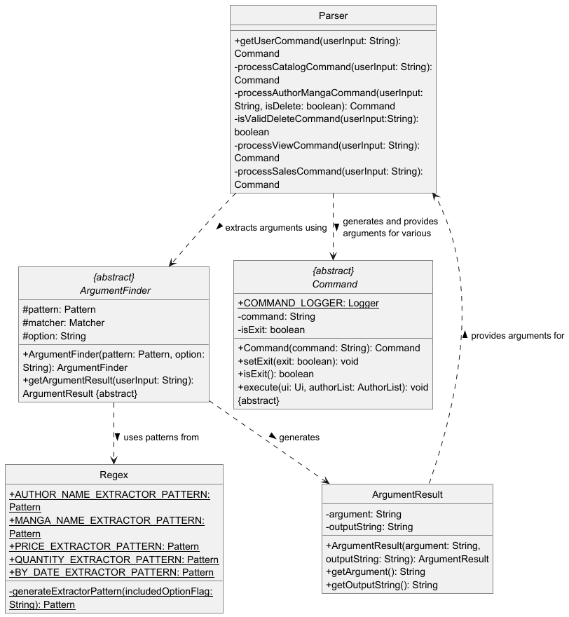


#### Overall Structure and Flow
Command generation first begins with the
`Parser` class. `Parser` first determines the command that the user
wishes to execute based on the first keyword provided. Then, `Parser` will employ various
`ArgumentFinder`s to extract the arguments of interest. Each specific implementation of the
abstract `ArgumentFinder` makes use of specific patterns generated in the
`Regex` class to extract their respective arguments of interest. These arguments are then packaged into a container
`ArgumentResult` object for `Parser` to later unpack to generate the right
`Command` with the required details. More information about `Command`s down below!

#### ArgumentFinder RegEx

The above diagram was generated
on [Regex Vis](https://regex-vis.com/?r=%28%3F%3C%3D%5Cs-a%29%24%7C%28%3F%3C%3D%5Cs-a%5Cs%29.*%3F%28%3F%3D%28%3F%3C%3D%5Cs%29-%5Bsb%5D%28%3F%3A%5Cs%7C%24%29%7C%24%29).
It visualizes the control flow of the RegEx engine used to extract fields from user inputs. In this case, the RegEx
pattern is used to isolate the author's name, excluding anything after the flags `-s` or `-b`. In `MangaTantou`'s
actual implementation, all valid flags in the app are excluded (including the author flag, for this case). A split
in the diagram means that both branches are valid matches.

Notice that the topmost branch matches an empty string is nothing is inputted after the `-a` flag.
This is intended, and this case is handled outside the RegEx in `Parser`. The bottom branch tries to match
everything between the `-a` author flag and any of the excluded flags, or the end of the string. Other unused flags,
such as `-x`, are included. This allows user to be more flexible in the allowed author names

#### Guidelines for Future Developers
To extend the parsing system to suit various operations i.e. generate new
`Command`s, the following guidelines outline the key aspects for working and expanding the parsing architecture:
1. **Defining New Keywords**
    - When defining new keywords as part of functionality expansions, do add the new keyword to the
      `Command` class in the `constants` package and update the `switch` statements under the
      `getUserCommand` method to return the relevant `Command`.
2. **Defining and Extracting New Arguments**
    - While the various `ArgumentFinder`s offer great reusability, should the need to implement a custom
      `ArgumentFinder` not yet implemented arise, do add the new flag/option of interest
      to the `Options` class under the `constants` package and expand the
      `OPTIONS_ARRAY` accordingly to register the newly added option. After which, implement the custom extractor
      `Pattern`
      under the `Regex` class and the custom `ArgumentFinder`.

And with that, you've successfully expanded `Parser` to generate new
`Command`s, each with their specific arguments of interest!

### Commands
<br/>
<br/>
<br/>
The current list of viable `Commands` are as follows:
1. `AddAuthorCommand`
2. `AddMangaCommand`
3. `DeleteAuthorCommand`
4. `DeleteMangaCommand`
5. `ViewAuthorsCommand`
6. `ViewMangasCommand`
7. `AddSalesCommand`
8. `AddDeadlineCommand`
9. `GreetCommand`
10. `ByeCommand`

#### Command Structure
All child `Command` classes must inherit from the abstract
`Command` class. Each child class is required to implement the abstract `execute` method.

While child classes may or may not modify the `AuthorList`, they are encouraged to utilize the
`Ui` class to interact with users, such as displaying success messages.

#### Guidelines for Future Developers
When adding new command classes, developers must follow the same method of implementation by
inheriting from the abstract `Command` class. Ensure that each new command class includes
an implementation of the `execute` method and appropriately interacts with the `Ui` class
for user feedback. Additionally, developers should update the `Parser` class to gather the
relevant arguments from the user for their commands. Lastly, it is important that developers expand the static `CommandValidator` and use it to
verify the correctness of the arguments provided and to throw the relevant exceptions otherwise.

### Saving Data
`AuthorList` data accumulated by the user can be saved with the provided `Storage` and `StorageHelper` classes.

#### Storage Structure
<br/>
The above UML class diagram outlines the structure of the classes related to saving data.

The `Storage` class uses the `Singleton` design pattern, which means only a maximum of one
`Storage` instance can exist during the program's lifespan. To access it, call the static method `Storage::getInstance`.

The `StorageHelper` utility class wraps the methods to access `Storage` for ease of use.

Data is by default stored in a JSON file `catalog.json` in the
`data` directory at the program root location, or if ran via a `.jar` file, the `.jar` file location. This is determined
at runtime in `Tantou.BASE_LOCATION` via `Tantou::getBaseDirectory`. The location can be changed via the
`public static final String DATA_PATH` constant in the `Storage.java` file.

The class makes use of the `Gson` third-party library to de/serialize data.

When needed, call `StorageHelper::readFile` to return the deserialized `AuthorList` from `catalog.json`.

Whenever a user action that modifies the state of the `AuthorList` is performed, the corresponding overridden
`Command::execute` method should call `StorageHelper::saveFile` after modifying the data.

#### Storage Behaviour
The following UML sequence diagrams outline the behaviour of the program when the user inputs a command that modifies
the
`AuthorList`.
<br/>
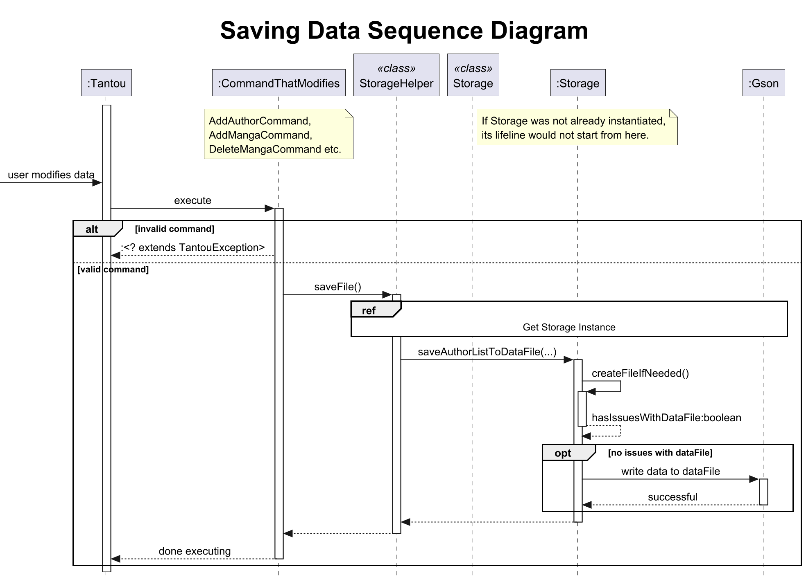<br/>
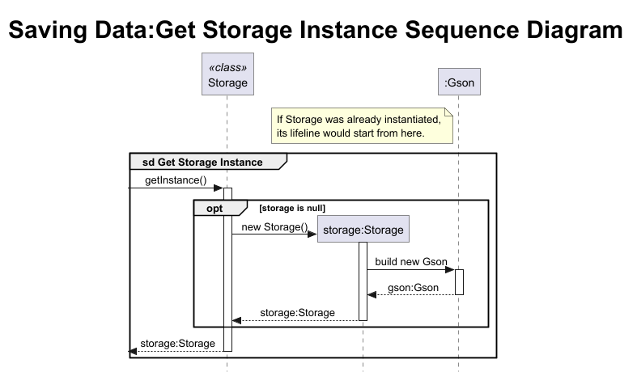<br/>

#### Gson De/serialization
Instead of using the default deserializers provided by
`Gson`, this project defines custom ones. This enables us to perform validity checks, via the `CommandValidator` class, on the key-value pairs in the data file
every step of the way, providing detailed and relevant information in the event deserialization is not successful. The
following is a code snippet showcasing some of the checks performed during the deserialization of data.
```
@Override
public MangaList deserialize(JsonElement json, Type typeOfMangaList, JsonDeserializationContext context)
        throws JsonParseException {
    // Ensure mangaList is a JSON array
    if (json == null || !json.isJsonArray()) {
        throw new JsonParseException("invalid MangaList array");
    }
    JsonArray mangaListJsonArray = json.getAsJsonArray();

    MangaList mangaList = new MangaList();
    for (int i = 0; i < mangaListJsonArray.size(); i++) {
        JsonElement mangaJsonElement = mangaListJsonArray.get(i);
        // Ensure manga is valid, skipping if not
        try {
            // pass Author reference
            Manga manga = new MangaDeserializer(author, mangaList)
                    .deserialize(mangaJsonElement, Manga.class, context);
            mangaList.add(manga);
        } catch (JsonParseException e) {
            Ui.printString(generateErrorMessage(e, i));
        }
    }

    // Assertion: mangaList is either empty, or contains only valid mangas
    return mangaList;
}
```

Additionally, to prevent infinite recursion due to the circular reference between an `Author` and their
`Manga` (stemming from bidirectional navigability; refer
to [Representing Data in MangaTantou](#representing-data-in-mangatantou))
, a custom `@ExcludeInSerialization` annotation was created to signal to
`Gson` to ignore the annotated class attribute when serializing the data. The following is a code snippet demonstrating
how the
`author` field is excluded in the `Manga` class.
```
public class Manga {
    private String mangaName;
    @ExcludeInSerialization
    private Author author;
    private String deadline;
    private Sale salesData;
    
    ...
}
```

#### Errors in Data File
```
[
  {
    "authorName": "test1",
    "mangaList": [
      {
        "mangaName": "manga 1-1",
        "deadline": "None",
        "salesData": {}
      },
      {
        "mangaName": "manga 1-2",
        "deadline": 31415,
        "salesData": {}
      }
    ]
  }
]
```
When providing the above `catalog.json` file and inputting `view -a test1`, the following output is given.
```
Author "test1": skipping invalid manga entry at index 1 due to invalid deadline
Data restored!
Wake up and slave~
view -a test1
Mangas authored by "test1", Total: 1
no. | Manga Name
----------------------------------------------
  1 | manga 1-1
```
As observed, the `deadline` of
`manga 1-2` is invalid. Instead of discarding the whole data file and starting with an empty
`AuthorList`, the deserializer skips `manga 1-2` altogether and tries to deserialize the rest.

This allows the user to manually edit their
`catalog.json` file with peace of mind that the program can catch their errors.

### Displaying Data
`AuthorList` data can be displayed with [view commands](#view-command). The
`Ui` class aids in presenting readable data to the user.

#### Ui Structure
<br/>
The above UML class diagram outlines the structure of the `Ui` and related classes.

The
`PrintColumn<T>` class represents the table columns to be printed. It contains attributes that help with the formatting
of a table column, such as width, header name, and a reference to getter methods (also known as
`valueProvider`s) in the `Author` and `Manga` data classes that return
`String`s. Default values for these attributes are provided in `PrintFormat.java` in the `constants` package.

Within the `PrintColumn<T>` class, methods format the values provided by the data class (`Author`, `Manga`, etc.) with
`String::format` (which is similar to `printf` in C/C++) into fixed-width columns.

With the list class that comprises instances of the data class (e.g. `AuthorList`, `MangaList`), a static method (e.g.
`MangaList::mangaColumnsToPrint`) is provided to get the print configuration for the data class given the argument flags
passed in the method. It returns an
`ArrayList` of `PrintColumn<T>`s configured based on what data should be in the column.

This static method should be called in the corresponding view `Command::execute` method, similar to the following form:
`Ui.printList(mangaList, mangaColumnsToPrint(...));`.

Refer to the [view command interaction](#view-command-interaction) for an example walkthrough of the methods mentioned
in this section.

## Interacting with the User
### Command Processing Sequence
All commands follow the command processing sequence shown below:


The `ref` block indicates a placeholder for the individual commands and their execution below.
### AddAuthorCommand
#### Overview
The `AddAuthorCommand` is responsible for adding new `Author`s to `MangaTantou`. The command creates a new
`Author` instance and verifies its existence. If it
is a new and undocumented `Author`, it is then added to `MangaTantou`'s `AuthorList`, allowing the user to keep track
of their manga authors. The `AuthorList` is saved via `Storage` for data persistence.
#### Interaction
The following diagram illustrates the interactions that take place when the
user provides `"catalog -a Kubo Tite"` as an input.
<br/>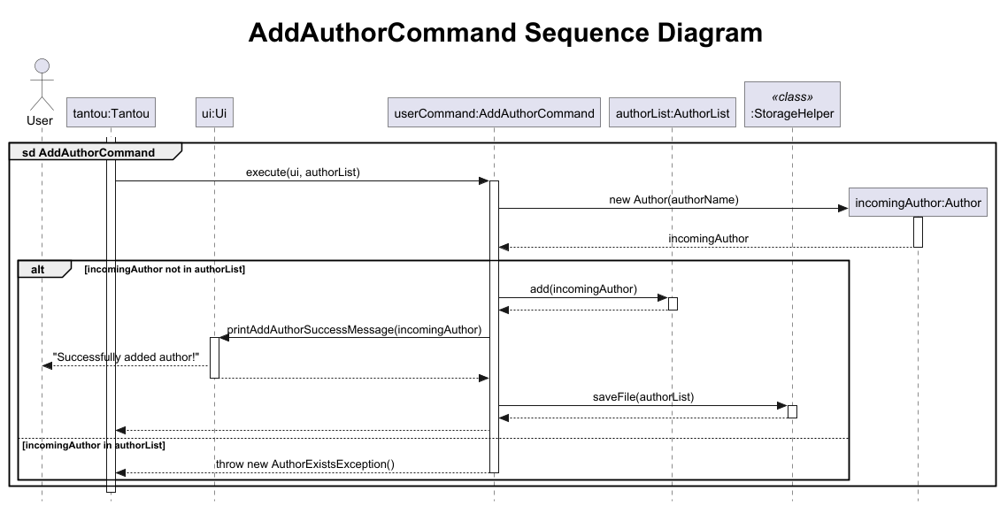<br/>
If the `Author` instance already exists, a `TantouException` is thrown, informing the user that
they are already tracking this employee.

### AddMangaCommand
#### Overview
The `AddMangaCommand` is responsible for adding new `Manga`s to `Author`s in
`MangaTantou`. The command first creates a new `Author` and `Manga` instance.
If the newly created `Author` is undocumented by `MangaTantou`, the `Author` is added to the
`AuthorList` and the newly created `Manga` is added to
the `Author`'s `MangaList`. If the `Author` already exists,
`MangaTantou` will check for the existence of the newly created `Manga`. If there is an existing
association between the `Manga` and `Author`, a
`TantouException` is thrown, informing the user that they are adding an existing `Manga`. Otherwise,
the `Manga` is similarly added to the `Author`'s `MangaList` and the current state of `AuthorList` is saved via
`Storage` for data persistence.
#### Interaction
The following diagram illustrates the interactions that take place when the
user provides `"catalog -a Kubo Tite -m Bleach"` as an input.
<br/>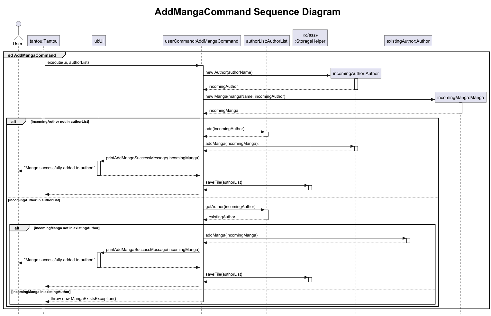<br/>

### DeleteAuthorCommand
#### Overview
The `DeleteAuthorCommand` is responsible for removing `Author`s from `MangaTantou`. The command creates a new
`Author` instance and verifies its existence. If it
is a new and undocumented `Author`, a `TantouException` is thrown, informing the user that this
`Author` does not exist and hence cannot be removed.
Otherwise, the `Author` is removed from the `AuthorList`, which is then saved via `Storage` for data persistence.
#### Interaction
The following diagram illustrates the interactions that take place when the
user provides `"catalog -a Kubo Tite -d"` as an input.
<br/>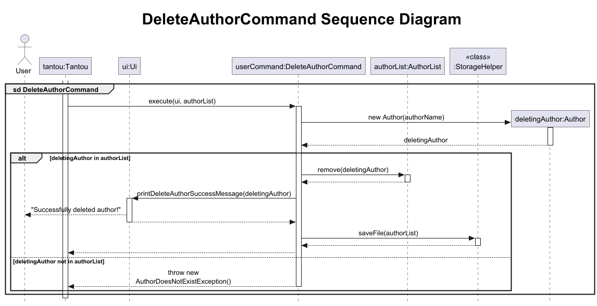<br/>

### DeleteMangaCommand
#### Overview
The `DeleteMangaCommand` is responsible for removing `Manga`s from `Author`s in
`MangaTantou`. The command first creates a new `Author` and `Manga` instance.
If the newly created `Author` is undocumented by `MangaTantou`, a
`TantouException` is thrown, informing the user that this `Author` does not exist and the `Manga` cannot be removed.
If the `Author` instead exists, `MangaTantou` will check for the existence of the newly created
`Manga`. If there is no existing
association between the `Manga` and `Author`, a
`TantouException` is thrown, informing the user that they are deleting a non-existing `Manga`. Otherwise,
the `Manga` is removed from the `Author`'s `MangaList` and the current state of `AuthorList` is saved via `Storage` for
data persistence.
#### Interaction
The following diagram illustrates the interactions that take place when the
user provides `"catalog -a Kubo Tite -m Bleach -d"` as an input.
<br/><br/>

### ViewCommand
#### Overview
The `ViewAuthorsCommand` and `ViewMangasCommand` are responsible for displaying a list of the various data entries in
`AuthorList`. Using the [`Ui` class](#displaying-data), it formats the data into a table.

For example, `view -a test1 -b -s` gives the following output (`b` for by-date/deadline, `s` for sales data).
```
view -a test1 -b -s
Mangas authored by "test1", Total: 2
no. | Manga Name                               | Deadline             | Unit Price | Units Sold | Revenue
-----------------------------------------------------------------------------------------------------------------
  1 | manga 1-1                                | None                 | N/A        | N/A        | N/A
  2 | manga 1-2                                | None                 | N/A        | N/A        | N/A
```

<h4 id="view-command-interaction">
Interaction
</h4>

The following UML sequence diagrams illustrate the interactions that take place when the user provides a valid
`ViewMangasCommand` command (e.g. `view -a test1 -b -s`, where `test1` is an author that already wrote some manga).
<br/>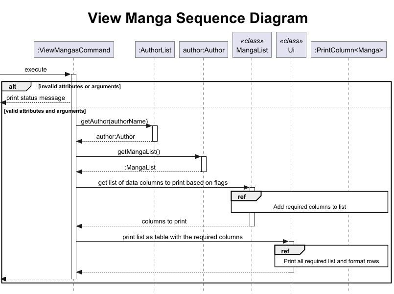<br/>
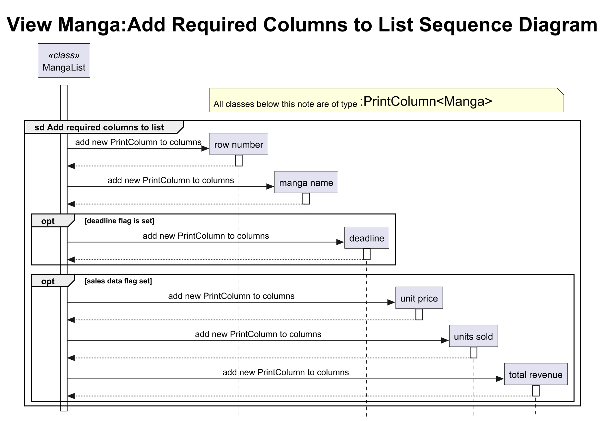<br/>
<br/>
`ViewAuthorsCommand` works similarly, but with only 2 required columns to print (row number and author name).

### AddSalesCommand
#### Overview
The AddSalesCommand is responsible for adding sales data to a Manga. The command replaces the current sales values with
the newly-entered values.
The Sale data consists of two attributes: `quantitySold` and `unitPrice`.

For the AddSalesCommand to be successful, the manga that the sales data is associated with must exist.
If the `sales` command is successful, the `Sales` data is then saved via Storage.
<br/>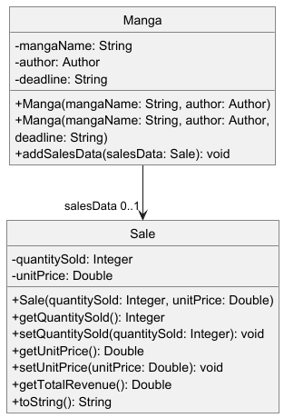<br/>

#### Interaction
The following sequence diagram illustrates the interactions that occur when the parser creates a new `AddSalesCommand`.
<br/>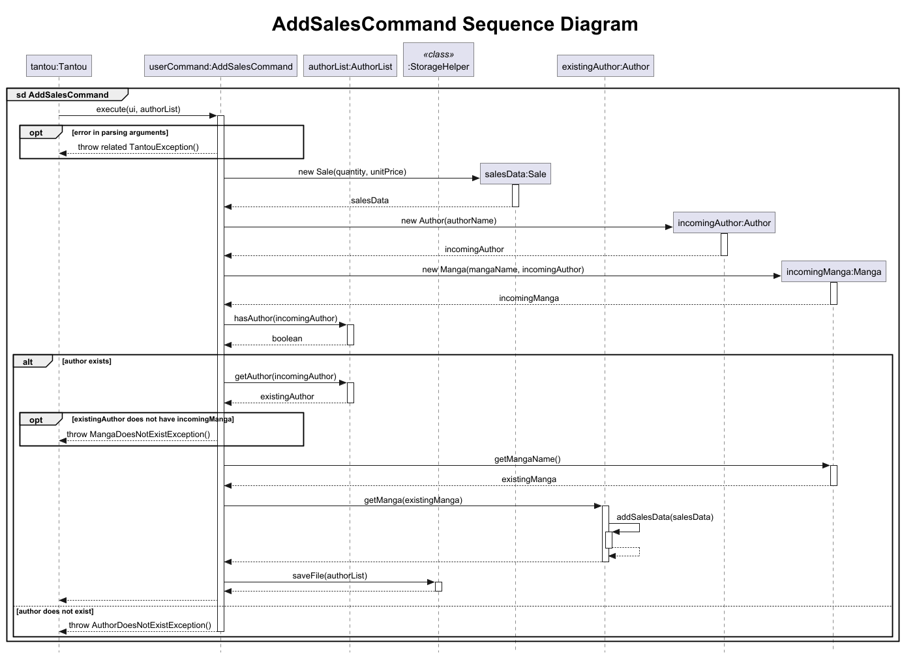<br/>

> **_NOTE:_
** The list of possible errors in parsing argument are as follows: missing arguments or flags, length of `author`/
`manga` name exceeded maximum value of 40 characters, length of
`deadline` string exceeded maximum value of 20 characters, negative values for
`quantitySold` or `unitPrice`, wrong number formats for `quantitySold` or
`unitPrice`, and numbers exceeding the value of 1,000,000,000.<br/>

### AddDeadlineCommand
#### Overview
AddDeadlineCommand changes the deadline on a specified manga. The deadline is kept as a String attribute
`deadline`. This is set to `"None"` by default when a manga is created.

When using `AddDeadlineCommand`, if the manga or author inputted does not exist, they are automatically created.

#### Interaction

The following sequence diagram illustrates the interactions that occur when the user inputs
`schedule -a Kubo Tite -m Bleach -b October 2 2018`

<br/>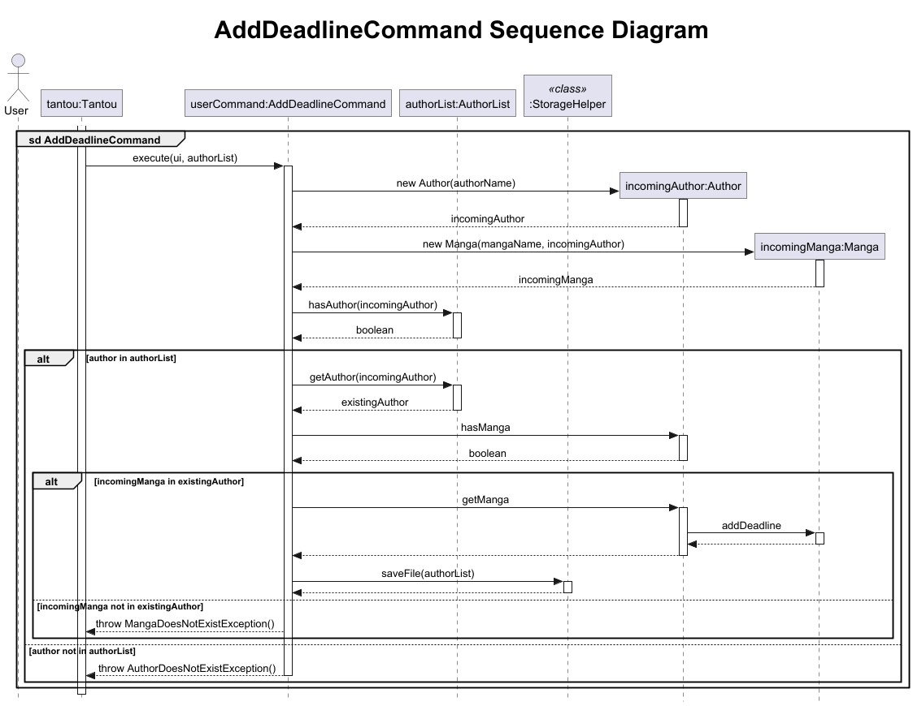<br/>

The following object diagram illustrates object structure after the above interaction is successfully run
with the input `schedule -a Kubo Tite -m Bleach -b October 2 2018`.
<br/>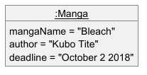<br/>

# Product Scope
## Target User Profile
`MangaTantou`'s target users are mainly chief editors at manga publishing companies. They are usually in charge of
monitoring the work of multiple authors under them, as well as deadlines and financial information. These editors should
also have a non-trivial amount of authors to keep track of, leading to tedious work if it were to be done manually.
Additionally, they are reasonably quick at typing and are competent with CLI apps.

## Value Proposition
Can manage author and manga information more easily than a physical ledger or a mouse-oriented GUI app.

# User Stories

| Version | As a ...                  | I want to ...                                          | So that I can ...                                             |
|---------|---------------------------|--------------------------------------------------------|---------------------------------------------------------------|
| v1.0    | editor of a manga company | add authors to a list                                  | keep track of my authors and potentially their work progress. |
| v1.0    | editor                    | add mangas to their respective authors                 | keep track of what each of my authors are working on.         |
| v1.0    | editor                    | delete authors under my charge                         | discharge under-performing authors under my charge.           |
| v1.0    | editor                    | delete mangas under an author                          | discontinue a series that is unpopular with the audiences.    |
| v1.0    | editor                    | view all the authors under me                          | keep track of them.                                           |
| v1.0    | editor                    | view all the mangas of an author under me              | keep track of their works.                                    |
| v1.0    | editor                    | be able to save the data from the app                  | access it again in the future.                                |
| v2.0    | business-minded editor    | add the quantity of copies sold for a manga            | track the manga's popularity amongst audiences.               |
| v2.0    | business-minded editor    | add the unit price of each copy sold for manga         | calculate the revenue earned by the series.                   |
| v2.0    | editor                    | view the deadlines of the manga of an author under me  | monitor their progress.                                       |
| v2.0    | business-minded editor    | view the sales data of the manga of an author under me | monitor the company's finances.                               |
| v2.0    | business-minded editor    | be able to save the sales data from the app            | access it again in the future.                                |

# Non-Functional Requirements
1. `MangaTantou` should work on any mainstream OS with Java 17 or above installed.
2. Commands should take no longer than 1s to respond.

# Glossary

* *Author* - An author can be in charge of writing multiple mangas. Two authors are considered to be the same author
  if they have the same name.
* *Manga* - Every manga has only one author. Two mangas are considered to be the same if they have the same title and
  author.

# Instructions for Testing
## Manual Testing
For a comprehensive list of all available commands, their purposes, and expected behavior, refer to
the [User Guide](UserGuide.md).
This guide outlines both typical and edge cases, providing a detailed reference to support manual testing and
validation.
## Testing with JUnit
All JUnit test cases are organized within the test directory, with tests segmented by package and class to maintain
focus and
modularity. This structure enhances test isolation, making it easier to validate specific functionalities. Each test is
designed
to verify the core components of the application, ensuring that key features operate as expected.
## Text UI Testing
All files required for Text UI testing are located in the `text-ui-test` directory. While the `input.txt` file contains
limited sample input
due to the coverage provided by JUnit tests, future developers can freely modify `input.txt` and `EXPECTED.txt` to
tailor tests for additional
scenarios as needed.

To execute the text UI test:
- On Windows: Run the following command:
  ```
  ./runtest.bat
  ```
- On UNIX-based systems: Use this command:
  ```
  ./runtest.sh
  ```
